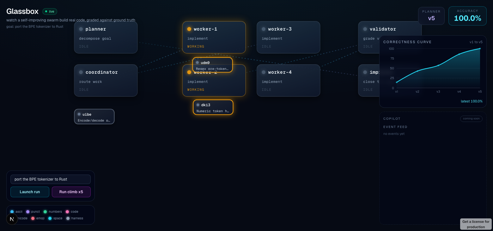

# Glassbox

**Agent swarms are black boxes. Glassbox is the glass cockpit that lets you watch a
self-improving swarm genuinely write code, graded live against a checkable oracle.**

A planner, coordinator, worker agents, a validator, and an improver coordinate over
Beads and Agent Mail. The workers really author the code (W&B Inference writes each
piece, the artifact is built and graded, and a vetted reference is the fallback when
the model misses). Every run is graded by a hard, checkable evaluator (no gating, no
hardcoded numbers), Weave traces and scores everything, and the improver rewrites the
planner skill from the real eval failures so correctness climbs across versions.

It is **general**: a task is `{goal, workspace, checkable evaluator}`, and the same
swarm runs any of them. We demonstrate three:

- **Rust BPE tokenizer**, graded by an exact token-ID diff against tiktoken gpt2.
- **Python `textkit` library**, graded by its **pytest** suite.
- **Bring your own repo**: hand it any real repo plus a test command and it discovers
  the failing test modules and fixes them with the LLM, with no fallback (the score is
  whatever the swarm actually earned, the source repo never mutated).

The same planner/coordinator/worker/validator/improver climbs all of them (tokenizer
~0.17 to 1.00, textkit 0.52 to 1.00), with zero swarm code changed between tasks.

Built at WeaveHacks 4 (W&B SF). Weave project:
https://wandb.ai/whitely-white-elk-llc/glassbox/weave



## Why it wins

- **The glass box plus ground truth.** Most teams build orchestration. Glassbox makes
  it legible (a tldraw cockpit animating every bead) and grades it against a hard,
  checkable evaluator, so the quality signal is real, not asserted.
- **The agents genuinely write the code.** The worker prompts the model with the
  current source and the validator's real failing cases, writes the edit, builds it,
  and keeps it only if the score genuinely improves; otherwise it falls back to a
  vetted reference (logged honestly). The score flows from the real built artifact.
- **It generalizes, and proves it.** The swarm is task-agnostic; the evaluator is
  pluggable (`harness/evaluator.py`). The tokenizer and the textkit are two configured
  tasks, and `+ repo` in the cockpit points the same loop at any repo you hand it: it
  discovers the failing tests and fixes them with the LLM and no safety net. Generality
  is bounded only by the evaluator: any task with an executable test suite or a
  reference to diff.
- **Genuine self-improvement.** The improver reads which groups failed in the real
  eval and rewrites the planner skill to add the missing bead. The skill evolves on
  disk and the accuracy climbs as a real consequence (snapshots per version).
- **Load-bearing sponsors.** Weave grades and is the self-improvement backbone, Redis
  is the live bus plus per-task leaderboard, CopilotKit is the command bar plus
  generative UI. None are bolted on.

## Architecture

```
Goal (CopilotKit chat) -> Planner decomposes -> Beads graph (br)
  -> Coordinator routes ready beads -> Workers AUTHOR the code (W&B Inference,
       build + self-check, reference fallback)
  -> Validator builds + runs the task's checkable evaluator -> score + a real Weave Evaluation
  -> Improver reads the eval gaps back FROM Weave -> rewrites the planner skill -> v(n+1)
  -> repeat (autonomous)

All agents -> Redis Stream glassbox:events -> SSE -> tldraw board
Per-task planner-version scores -> Redis sorted sets -> the climbing curve
```

| Layer | Tech |
| --- | --- |
| Coordination | Agent Mail (MCP), Beads (`br`) |
| Observability + eval + self-improvement | W&B Weave + W&B MCP server |
| Event bus + per-task leaderboard | Redis (Streams + sorted sets) |
| Cockpit | Next.js + tldraw + CopilotKit (AG-UI) + recharts |
| Checkable evaluators | exact token-ID diff (tiktoken gpt2); pytest |
| Swarm inference | W&B Inference (openai/gpt-oss-120b et al.), Weave-traced |

## Loop shapes

Every shape runs the same swarm engine: decompose the goal into tasks, dispatch each
to a sub-agent, verify the results for real. What differs is the stop condition, so
each shape is named by its motion, a single-syllable verb. The 8 ids are canonical in
`contract/glassbox.contract.json` ("archetypes"), shared by the TS cockpit and the
Python swarm. The board redraws the loop's return edge per shape, and you pick a shape
in the `/swarm` view or deep-link it with `?shape=`.

| Shape | What it does | Stops |
| --- | --- | --- |
| Land | Drive to a done-state, then stop. | When the goal is verified done. |
| Climb | Push a metric until it stops improving. | When you can no longer beat your best. |
| Hold | Keep an invariant true, repair drift. | Never, repairs whatever drifts. |
| Watch | Ingest a stream, report a digest each round. | Never, reports every round. |
| Burst | Fan out once, synthesize, done. | After one round. |
| Sweep | Drain a finite backlog, wave by wave. | When the backlog is empty. |
| Dig | Discover until the finds run dry. | After two rounds with nothing new. |
| Race | Same goal, competing attempts, one judge. | When the judge picks a winner. |

## Layout

- `apps/web/` cockpit (tldraw board + CopilotKit), port 3100
- `agents/` swarm (planner, coordinator, workers, validator, improver) + FastAPI, port 8100
- `tasks/` the pluggable tasks: `tokenizer/` (Rust) and `textkit/` (Python), each a
  `{goal, workspace, evaluator, skill}` package
- `harness/` the checkable evaluators (the tiktoken oracle + the pytest runner) and fixtures
- `contract/` the integration seam (events + Redis keys + ports)
- `docs/` PRD, demo script, submission writeup

## Run

```bash
cp .env.example .env       # team keys already set
pnpm install && uv sync
pnpm redis                                 # local Redis :6379
GLASSBOX_PACE_MS=600 pnpm backend          # swarm + server :8100 (paced for the demo)
pnpm web                                   # cockpit :3100
```

Open `http://localhost:3100`. Pick a task (tokenizer or textkit) in the command bar, or
click `+ repo` to bring your own (a repo path or git URL plus a test command). Then
Launch run (single full plan), Run climb (the genuine self-improvement loop), or Run
live (the spot-a-gap inject beat). Workers author with the model by default; set
`GLASSBOX_WORKER_LLM=0` for the fast, fully reliable deterministic path on a live board
(curated tasks only; bring-your-own-repo always uses the model with no fallback).

From the CLI: `uv run python -m agents.run "<goal>" <run-base> <versions> <task>`
(e.g. `... "build textkit" textkit 6 textkit`).

Ports 3100 and 8100 are deliberate (3000/8000 are reserved on this machine).

See `docs/DEMO.md` for the 3 minute script, `docs/SUBMISSION.md` for the writeup,
`docs/prds/GLASSBOX_PRD.md` for the original plan, and `CLAUDE.md` for conventions.
